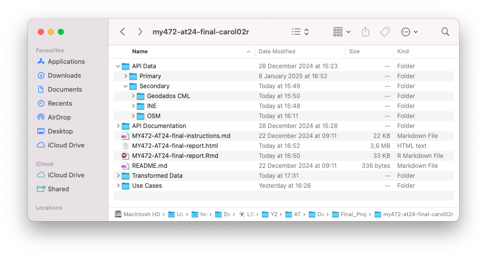

```{r setup, include=FALSE}
knitr::opts_chunk$set(echo = TRUE)
```

**Prompt:** 1

**ChatGPT/AI disclosure statement:** I used ChatGPT in this assignment to perform complex transformations in the data and to support the creation of visualizations with spatial data.


## 1. Lisbon's Rental Crisis

Lisbon faces an extreme rental crisis that has become unbearable for its residents. Since 2010, average rent in the city has risen by almost 80%, while salaries remain stagnant. Lisbon now leads European cities in the proportion of income allocated to rent payments, far exceeding the Bank of Portugal's recommended rent-to-income ratio of 35%.

To better understand this policy issue, I've compiled detailed rental property data from Idealista, a leading real estate platform in Portugal. Additionally, I retrieved socioeconomic indicators at the municipality level from Portugal's National Statistics Institute (INE), providing a broader context for rental price dynamics. I've also included  geographical data on key amenities and municipality boundaries to visually enrich the analysis.

This dataset has immense potential for urban planning and policy development. It supports monitoring of the rental market and affordability trends. Geographical analysis can identify hotspots of rising prices and particular fragility for residents, with compelling visuals for non-technical stakeholders. It can also power machine learning models to predict prices based on property and municipality characteristics. This data-driven approach not only supports policy-makers in tackling Lisbon's rental crisis but also provides a replicable framework for other cities.

## 2. Primary Data: Rental Properties

As primary data, I collected information on all rental properties available in Lisbon as of December 22, 2024. This qualifies as primary data because it was gathered firsthand for this project and, to my knowledge, no similar compilation of rental information exists for the city.

This data was automatically retrieved from [Idealista](https://www.idealista.pt) using their API (documentation included in the repository), for which I've requested a key [here](https://developers.idealista.com/access-request). The API returns a JSON response with several attributes for each property, and I've selected the most relevant ones to transform into a tidy, tabular dataset tailored to this research.

To address ethical concerns, property location coordinates are approximate to avoid exposing exact addresses. API usage is subject to a small query limit, which can be expanded upon request. To comply with that and follow good scraping practices, I set `eval=FALSE` throughout and stored all relevant results for reference.

```{r packages, message=FALSE, eval=TRUE}
# importing necessary packages
# assuming everything has been installed previously

# data wrangling, analysis  
library(tidyverse)  
library(dplyr)  
library(stringr)
library(fBasics)

# web scraping, APIs  
library(RSelenium)  
library(rvest)  
library(httr)  
library(robotstxt)  
library(jsonlite)  
library(xml2) 

# authentication 
library(keyring)  
library(openssl)  

# spatial data
library(sf)  
library(osmdata)  
library(ggplot2)
library(ggspatial)

# aesthetics
library(knitr)  
library(kableExtra) 
library(stargazer)
library(DT)
```

First, I use the API credentials provided and perform the necessary transformations to generate my authorization key and headers for API requests.

```{r idealista_token, eval = FALSE}
### to store your key and secret locally
# only run this once if you haven't before
# key_set(service = "idealista", username = "api_key")
# key_set(service = "idealista", username = "secret")

# retrieve API key and secret from keyring
api_key <- key_get(service = "idealista", username = "api_key")
secret <- key_get(service = "idealista", username = "secret")

# error handling
if (is.null(api_key) || is.null(secret)) {
  stop("API Key or Secret missing from keyring. Please store them first.")}


### create authorization key - instructions in documentation
# step 1. URL encode the API key and secret
encoded_api_key <- URLencode(api_key, reserved = TRUE)
encoded_secret <- URLencode(secret, reserved = TRUE)

# step 2. concatenate encoded key and secret with colon
combined_string <- paste0(encoded_api_key, ":", encoded_secret)

# step 3. base64 encode to get "authorization" token
base64_token <- base64_encode(charToRaw(combined_string))

# step 4. insert "basic" before the base64 token
authorization <- paste0("Basic ", base64_token)


### get acess token for API request header
# extract access token from OAuth response using authorization key
response <- POST("https://api.idealista.com/oauth/token", 
                 body = list(grant_type = "client_credentials", 
                             scope = "read"), 
                 add_headers(Authorization = authorization))

# parse response as json and retrieve token
oauth_content <- content(response, as = "parsed", type = "application/json")
access_token <- oauth_content$access_token

# error handling
if (is.null(access_token)) {
  stop("Error: Access token is missing.")}

# set headers for API request
headers <- add_headers(
  Authorization = paste("Bearer", access_token))
```

Here, I call the API to retrieve results for the first 50 rental properties. This helps determine the total number of pages on the website, which is essential to retrieve all listings later.

```{r use_idealista_API, eval = FALSE}
# base url for portugal
base_url <- 'https://api.idealista.com/3.5/pt/search?'

# query parameters
params <- list(
  # summary language - english
  locale = "en",
  # API limit is 50 items per page
  maxItems = 50,
  # first page
  numPage = 1,
  # only rental properties
  operation = "rent",
  propertyType = "homes",
  # lisbon city ID, found here: https://igolaizola.github.io/idealista-scraper/
  locationId = "0-EU-PT-11-06")

### send first request - will retrieve 50 results from first page
response <- POST(url = base_url, headers, query = params)

# check response - error handling
if (http_status(response)$category == "Success") {
  # parse as json if successful
  first_page <- content(response, as = "parsed", type = "application/json")
  } else {
    stop("Request failed with status: ", http_status(response)$message)}

# retrieve number of pages to loop through
total_pages <- first_page$totalPages
```

After examining these results, I write a function to select relevant property information and store it in a dataframe where each row represents a property and each attribute is a column.

```{r dataframe_format, eval = FALSE}
# list of desired attributes to extract
elements <- c("address", "price", "propertyType", "size", 
              "rooms", "bathrooms", "floor", "status", "priceByArea", 
              "municipality", "district", "latitude", "longitude", 
              "hasLift", "description", "url")

### function to process each page's element list
process_page_data <- function(page_data) {
  # empty list for page property list
  prop_list <- list()
  # loop over each property (in elementList, [[1]] to [[n]])
  for (i in 1:length(page_data$elementList)) {
    # empty list to store property info
    property <- list()
    # loop through attributes to extract
    for (element in elements) {
      # check if the attribute exists for the current property
      if (!is.null(page_data$elementList[[i]][[element]])) {
        # if it exists, assign value
        property[[element]] <- page_data$elementList[[i]][[element]]
        } else {
          # if not, assign NA
          property[[element]] <- NA}}
    
    # add property to prop_list
    prop_list[[i]] <- property}
  
  # convert list of properties to dataframe
  ### * the following line of code was generated by ChatGPT
  properties <- do.call(rbind, lapply(prop_list, as.data.frame))
  
  return(properties)}

# process first 50 results and store them in the dataframe
  # so as not to unnecessarily repeat this query
properties <- process_page_data(first_page)
```

If there's more than one page, I loop through the remaining pages. I retrieve and process the response for each and append it to the existing dataset, ensuring to get the complete list of rental properties. Finally, I save the dataset in RDS and CSV format.

```{r idealista_loop_pages, eval = FALSE}
### create loop through remaining pages and concatenate with existing data
if (total_pages > 1) {
  # loop through pages (2 to total_pages)
  for (page_num in 2:total_pages) {
    # update the page number in query params
    params$numPage <- page_num
    # send request
    response <- POST(url = base_url, headers, query = params)
    
    # check if successful response
    if (http_status(response)$category == "Success") {
      # if successful, parse the response
      page <- content(response, as = "parsed", type = "application/json")
      # use function above to format reponse
      prop_page <- process_page_data(page)
      # append page data to the overall properties list
      properties <- rbind(properties, prop_page)
      
      } else {
      # if request failed, print error message and move on to next page
        print("Skipping page ", page_num, " due to failed request. Moving to next page.")
        # random wait time between 1 and 2 seconds - per API documentation
        wait_time <- runif(1, min = 1, max = 2)
        Sys.sleep(wait_time)
        next}
  
    # wait time
    wait_time <- runif(1, min = 1, max = 2)
    Sys.sleep(wait_time)}}

# save to r format and csv file
saveRDS(properties, file = "Ouput Data/Primary/properties_full.rds")
write.csv(properties, "Ouput Data/Primary/properties_full.csv", row.names = FALSE)
```

## 3. Secondary Data: Socioeconomic Indicators, Amenities, and Geographic Information

This section compiles existing data from multiple sources into a body of supporting information. To avoid repeating queries, I've set `eval=FALSE` and stored all relevant results for reference.

First, I extract municipality boundary data from [Geodados CML](https://geodados-cml.hub.arcgis.com/datasets/CML::limite-cartografia/explore?layer=0&location=38.738323%2C-9.162245%2C12.66) using their GeoJSON API. The raw JSON response is saved, and the data is also parsed into a tabular format and saved in RDS format. I cannot immediately save it as CSV due to the complex spatial data contained in one column.

```{r municipality_geojson, eval=FALSE}
url <- "https://services.arcgis.com/1dSrzEWVQn5kHHyK/arcgis/rest/services/Limite_Cartografia/FeatureServer/0/query?where=1%3D1&outFields=*&outSR=4326&f=json"

# get API response
geojson_data <- GET(url)

# error handling - if failed request
if (http_status(geojson_data)$category != "Success") {
  stop("API request failed.")}

# extract content as json
municipalities <- content(geojson_data, as = "text", encoding = "UTF-8")

# save raw json for reference
writeLines(municipalities, "API Data/Secondary/Geodados CML/geo_municipalities.json")

# parse json into R object
json_parsed <- fromJSON(municipalities, flatten = TRUE)

# metadata contained in 'json_parsed$fields' - not relevant
# extract object dataframe with actual geographical data
features <- json_parsed$feature

# save
saveRDS(features, file = "API Data/Secondary/Geodados CML/geo_municipalities_tab.rds")
```

Next, I extracted relevant socioeconomic indicators from [INE](https://www.ine.pt/xportal/xmain?xpgid=ine_main&xpid=INE) via its API (documentation included in this repository). 

For each API call, appropriate municipality geo-dimension codes are necessary, which I scraped from [here](https://smi.ine.pt/Versao/Detalhes/5217) using RSelenium. The script interacts with dropdown menus to extract name and code for each municipality (raw HTML saved in JSON format), processes the data into tabular format and finally saves it as a CSV file.

```{r ine_geocode_scrape, eval=FALSE}
# to extract INE geo-dimension codes for all municipalities

url <- 'https://smi.ine.pt/Versao/Detalhes/5217'

# start selenium server
rD <- rsDriver(browser=c("firefox"), verbose = F, 
               port = netstat::free_port(random = TRUE), chromever = NULL) 

# call for setting the driver client
driver <- rD$client

# navigate to the url
driver$navigate(url)
Sys.sleep(2)

# making municipality selection
# define list of selectors for each element
selection_click_list <- c(
  
  # button to open "view categories"
  "//*[@href='/Categoria/Parent/5217']",
  
  # button to expand "Continente"
  "//li[@id='4963713']//div[contains(@class, 'expandable-hitarea')]",

  # button to expand "Grande Lisboa"
  # two layers deep
  "//li[@id='4966397']//div[contains(@class, 'expandable-hitarea')]",
  "//li[@id='4966398']//div[contains(@class, 'expandable-hitarea')]",

  # button to expand "Lisboa"
  "//li[@id='4966411']//div[contains(@class, 'expandable-hitarea')]")

# loop through list and interact with each element
for (xpath_selector in selection_click_list) {
  # find element using xpath
  element <- driver$findElement(using = 'xpath', value = xpath_selector)
  # click element
  element$clickElement()
  # add delay - to allow for reload
  Sys.sleep(2)}

# get page source code
page <- read_html(driver$getPageSource()[[1]])

# get all elements of the list below path "a[...]" on the last dropdown
### * the following code lines were generated by ChatGPT
municipality_codes <- page %>%
  html_elements("a[data-ajax='true'][data-ajax-complete*='/Categoria/Detalhes/4966411'] ~ ul li") %>%
  html_text()

#save json
writeLines(municipality_codes, "API Data/Secondary/INE/ine_municipality_codes.json")

# convert to tabular dataset with columns code and municipality
ine_municipality_codes_df <- municipality_codes %>% 
  # remove all white space
  trimws() %>%
  # separate by the dash - nested list
  strsplit(" - ") %>%
  # nested list to matrix
  do.call(rbind, .) %>%
  # matrix to data frame
  as.data.frame(stringsAsFactors = FALSE) %>%
  # rename columns
  setNames(c("ine_code", "municipality"))

# save csv  
write.csv(ine_municipality_codes_df, "API Data/Secondary/INE/ine_municipality_codes.csv", row.names = FALSE)
```

I selected a set of variables covering earnings, demographics, employment, infrastructure, etc., and recorded the most recent year of data collection for each. The main limitation here is the lack of consistency in year of collection across variables. Then, I create functions to validate the state of API responses and fetch data.

```{r setup_INE_API, eval=FALSE}
### api query parameters
# varcd_cod: code of the indicator
indicators <- c("0012674", "0012741", "0012744", "0012450", "0012320", 
                "0012327", "0012299", "0012581", "0012314", "0012328", "0012272")
# dim1_cod: code of the time dimension
years <- c("2022", "2022", "2022", "2023", "2021", "2021", "2021", 
           "2021", "2021", "2021", "2021")
# dim2_cod: code of the geographic dimension
# dim??_cod : any other dimension, as long as it is available in the chosen indicator

# initialize empty dataframe to store API results
municipality_stats <- data.frame(
  indicator = character(),
  year = numeric(),
  municipality = character(),
  value = numeric(),
  stringsAsFactors = FALSE)

### function to check the response for success
test_response <- function(response, indicator, code) {
  # check if request was successful
  if (status_code(response) == 200) {
    # parse response as json
    json_data <- content(response, as = "parsed", type = "application/json")
    # second layer of validation
    # check if the response contains valid data ('Sucesso' field is not "Falso")
    if (names(json_data[[1]]$Sucesso)[1] == "Falso") {
      # if invalid response...
      return(NULL)}
      # if valid response...
      # return json data
    return(json_data)}
  # if invalid http status code...
  return(NULL)}

### function to fetch data
fetch_data <- function(indicator, year, code) {
  # build URL dynamically based on current indicator, municipality, and year
  url <- paste0("https://www.ine.pt/ine/json_indicador/pindica.jsp?op=2&varcd=", indicators[i],
                  "&Dim1=S7A", years[i], "&Dim2=", code, "&lang=EN")
  
  # get initial response
  response <- GET(url)
  # check response using the test_response function
  json_data <- test_response(response, indicator, code)
  
  # return valid json_data or NULL
  return(json_data)}
```

Finally, I loop through each selected indicator and municipality and retrieve responses. The results are compiled into a single dataset, which I organized into a tidy format through pivoting. The data is stored in RDS and CSV format.

```{r use_INE_API, eval=FALSE}
### retrieve data from API
# loop through (indicator, year) pairs
for (i in seq_along(indicators)) {
  # loop through municipalities
  for (code in ine_municipality_codes_df$ine_code) {
    
    # check if the response is valid, if not retry with modified municipality code
    json_data <- fetch_data(indicators[i], years[i], code)
    
    if (is.null(json_data)) {
      # retry with modified municipality code (prefix with '1A0')
      code_new <- paste0('1A0', code)
      
      # check the response again with modified code
      json_data <- fetch_data(indicators[i], years[i], code_new)
      
      if (is.null(json_data)) {
        print("Error: Failed to fetch data for indicator", indicators[i], 
                             "in municipality", code, "in year", years[i])
        # skip to the next municipality if both attempts fail
        next}}
    
    # handle results with multiple entries for subvariables
    # i.e., gender is dim_3 and age group is dim_4
    if (length(json_data[[1]]$Dados[[1]]) > 3) {
      ### * the following line of code were generated by ChatGPT
      entry <- Filter(function(entry) entry$dim_3 == "T" && entry$dim_4 == "T", json_data[[1]]$Dados[[1]])
    } else if (length(json_data[[1]]$Dados[[1]]) == 3) {
      entry <- Filter(function(entry) entry$dim_3 == "T", json_data[[1]]$Dados[[1]])
    } else {
      entry <- json_data[[1]]$Dados[[1]]}
    
    # extract relevant data from response
    result_table <- data.frame(
      indicator = json_data[[1]]$IndicadorDsg,
      year = as.numeric(years[i]),
      municipality = entry[[1]]$geodsg,
      value = as.numeric(entry[[1]]$valor),
      stringsAsFactors = FALSE)
    
    # add the result to the final dataframe
    municipality_stats <- rbind(municipality_stats, result_table)
    
    # add some wait time before next request
    Sys.sleep(1)}}

### make tidy
# pivot wider
municipality_stats_wide <- municipality_stats %>%
  # dropping year column
  select(-year) %>%  
  pivot_wider(
    # use indicator as the column names
    names_from = indicator,
    # use 'value' as the data for the indicator columns
    values_from = value)

# save 
saveRDS(municipality_stats_wide, file = "API Data/Secondary/INE/ine_municipality_stats.rds")
write.csv(municipality_stats_wide, "API Data/Secondary/INE/ine_municipality_stats.csv", 
          row.names = FALSE)
```

Lastly, I used the OpenStreetMap API to retrieve the location of key city amenities. I've focused on parks, hospitals, police stations, metro and bus stops, though other options could be considered. I found the appropriate filters [here](https://wiki.openstreetmap.org/wiki/Map_features). The resulting tabular data was stored.

```{r amenity_osm, eval=FALSE}
# box for lisbon
# http://bboxfinder.com/#38.690869,-9.242249,38.801992,-9.080200
bbox <- c(-9.242249,38.690869,-9.080200,38.801992)

# query: add a filter and retrieve OpenStreetMap data for the bounding box
hospitals <- opq(bbox = bbox) %>%
  add_osm_feature(key = "amenity", value=c("hospital")) %>%
  osmdata_sf()

police <- opq(bbox = bbox) %>%
  add_osm_feature(key = "amenity", value=c("police")) %>%
  osmdata_sf()

bus_stops <- opq(bbox = bbox) %>%
  add_osm_feature(key = "public_transport", value=c("stop_position")) %>%
  add_osm_feature(key = "bus", value=c("yes")) %>%
  osmdata_sf()

metro <- opq(bbox = bbox) %>%
  add_osm_feature(key = "railway", value=c("subway_entrance")) %>%
  osmdata_sf()

parks <- opq(bbox = bbox) %>%
  add_osm_feature(key = "leisure", value=c("park")) %>%
  osmdata_sf()

# turn into one dataset
all_amenities <- bind_rows(
  # format locations for sf and include type of amenity
  st_as_sf(hospitals$osm_points) %>% mutate(type = "Hospital"),
  st_as_sf(police$osm_points) %>% mutate(type = "Police Station"),
  st_as_sf(bus_stops$osm_points) %>% mutate(type = "Bus Stop"),
  st_as_sf(metro$osm_points) %>% mutate(type = "Metro Station"),
  st_as_sf(parks$osm_points) %>% mutate(type = "Park")) %>%
  # keep only location and type of amenity
  select(geometry, type)

# save with spatial format intact
saveRDS(all_amenities, file = "API Data/Secondary/OSM/amenities.rds")

# save as csv
# turn spatial format into latitude and longitude columns
csv_amenities <- cbind(as.data.frame(all_amenities), st_coordinates(all_amenities)) %>%
  rename(longitude = X, latitude = Y) %>% 
  select(-geometry)
write.csv(csv_amenities, "API Data/Secondary/OSM/amenities.csv", row.names = FALSE)
```

## 4. Tabular data and transformations

Here's a preview of the tidy tabular data I've built for my 5 sources:

- Idealista property list:

```{r show_Idealista, eval=TRUE}
prop <- read.csv('API Data/Primary/properties_full.csv')

# temporary copy for display - truncated description
temp_prop <- prop
temp_prop$description <- substr(temp_prop$description, 1, 200)

datatable(temp_prop[1:10, ])
```

- Geodados CML municipality borders:

```{r show_CML, eval=TRUE}
geo <- readRDS('API Data/Secondary/Geodados CML/geo_municipalities_tab.rds')

# temporary copy for display - truncated geometry rings
temp_geo <- geo
temp_geo$geometry.rings <- substr(temp_geo$geometry.rings, 1, 20)

datatable(temp_geo)
```

- INE municipality codes:

```{r show_INE_codes, eval=TRUE}
ine_codes <- read.csv('API Data/Secondary/INE/ine_municipality_codes.csv')

datatable(ine_codes)
```

- INE socioeconomic indicators:

```{r show_INE_stats, eval=TRUE}
ine_stats <- read.csv('API Data/Secondary/INE/ine_municipality_stats.csv')

datatable(ine_stats)
```

- OSM amenities:

```{r show_OSM, eval=TRUE}
amenities <- readRDS('API Data/Secondary/OSM/amenities.rds')

# create temporary version for display
temp_am <- amenities
# convert spatial data to text for html knitting
temp_am$geometry_wkt <- st_as_text(temp_am$geometry)

temp_am <- temp_am %>%
  st_drop_geometry() %>%
  rename(geometry = geometry_wkt)

# as.data.frame for spatial data visualization
datatable(as.data.frame(temp_am[1:10, c("type", "geometry")]))
```

Here's a visual of this data:

```{r plot_osm, message=FALSE, eval=TRUE}
### * the following visualisation was mostly generated by ChatGPT
# specific formatting for plot
bbox <- c(xmin = -9.242249, ymin = 38.690869, xmax = -9.080200, ymax = 38.801992)
bbox_sf <- st_as_sfc(st_bbox(bbox, crs = st_crs(4326)))

ggplot() +
  # toned-down background map for bounding box
  annotation_map_tile(type = "cartolight", zoom=12) +
  # bounding box
  # amenity location
  geom_sf(data = amenities, aes(color = type), size = 0.5, alpha = 0.3, show.legend = TRUE) +
  scale_color_manual(
    values = c(
      "Park" = "#bfef45",
      "Police Station" = "#4368d8",
      "Bus Stop" = "orange",
      "Metro Station" = "purple",
      "Hospital" = "red"),
    name = "Amenity Type") +
  ggtitle("Amenities of Interest in Lisbon") +
  theme_minimal() +
  labs(x = "Longitude", y = "Latitude",
       caption = "Data Source: OpenStreetMap") + 
  theme(axis.text = element_blank(),
        axis.ticks = element_blank(),
        axis.title = element_blank(),
        plot.title = element_text(face = "bold", size = 16))+
  guides(color = guide_legend(override.aes = list(size = 3, alpha=1)))
```

In addition to tidying the data, I'll apply 5 further transformations:

1. Simplify variable names and retain only relevant ones.

```{r transf_1, eval=TRUE}
### ine statistics
# create new name for each variable
new_names <- c("municipality",
               "av_gross_income_hhold",
               "median_net_income_hhold",
               "gini_coef_net_income_hhold",
               "live_births",
               "oldest_age_ratio",
               "upper_sec_education",
               "homeless",
               "build_repair",
               "foreign_res",
               "unemployment",
               "var_resident_pop")

# rename all variables
names(ine_stats) <- new_names

### geojson
# clean up column names
colnames(geo) <- gsub("^attributes\\.", "", colnames(geo))
# remove unnecessary information
geo <- geo[, c("NOME", "PERIMETRO", "AREA_M2", "Shape__Area", "Shape__Length", "geometry.rings")]
```

2. Correct coordinate format for proper spatial plotting.

```{r transf_2, eval=TRUE}
geo <- geo %>%
  # transform geometry rings into polygons
  ### * the following lines of code were generated by ChatGPT
  mutate(geometry = st_sfc(lapply(geometry.rings, function(ring) {
    # ensure the ring is a matrix with 2 columns (longitude and latitude)
    polygon_matrix <- ring[1, , ]
    # create the polygon from the matrix
    st_polygon(list(polygon_matrix))}))) %>%
  select(-geometry.rings) %>% 
  st_as_sf()
```

3. Merge municipality indicators, codes, and boundaries to create a complete municipality dataset.

```{r transf_3, eval=TRUE}
geo <- geo %>%
  rename(municipality = NOME)

# left join ine_stats and ine_codes
merged_data_ine <- merge(ine_stats, ine_codes, by = "municipality", all.x = TRUE)

# left join the resulting merged data with geo
municipality_merged_data <- merge(merged_data_ine, geo, by = "municipality", all.x = TRUE)

# temporary version with trimmed (string) geometry for display
temp <- municipality_merged_data
temp$geometry <- substr(temp$geometry, 1, 30)

datatable(temp)
```

4. Create variables for proximity to key amenities.

```{r transf_4, eval=TRUE}
# transform into spatial object for distance calculations
prop_sf <- st_as_sf(prop, coords = c("longitude", "latitude"), crs = 4326)

amenity_types <- unique(amenities$type)

# loop through each amenity type
# calculate the distance from each property to the nearest amenity of that type
for (amenity_type in amenity_types) {
  # filter amenities of the current type
  amenities_of_type <- amenities %>%
    filter(type == amenity_type)
  # create variable
  dist_colname <- paste0("dist_nearest_", gsub(" ", "_", tolower(amenity_type)))
  # calculate and assign distance to nearest amenity for each property
  ### * the following line of code was generated by ChatGPT
  prop_sf[[dist_colname]] <- st_distance(prop_sf, amenities_of_type) %>%
    apply(1, min)}

# turn spatial format back into standard dataframe
prop <- cbind(as.data.frame(prop_sf), st_coordinates(prop_sf)) %>%
  rename(longitude = X, latitude = Y) %>% 
  select(-geometry)

### display syummary stats
# get distance columns
distance_columns <- grep("^dist_nearest_", names(prop), value = TRUE)

prop %>%
  # select distance columns
  select(all_of(distance_columns)) %>%
  # calculate summary statistics
  basicStats() %>%
  # get important ones
  .[c("Minimum", "Mean", "Median", "Maximum", "Stdev"), ] %>% 
  round(2) %>%
  kable(format = "html", caption="Distance measured in meters") %>%
  kable_styling("striped", full_width = FALSE, position = "left") 
```

5.  Create a luxury indicator by filtering out upper price-per-square-meter outliers.

```{r transf_5, eval=TRUE}
# calculate interquartile range for "priceByArea" variable
q1 <- quantile(prop$priceByArea, 0.25, na.rm = TRUE)
q3 <- quantile(prop$priceByArea, 0.75, na.rm = TRUE)
iqr <- q3 - q1

# define upper bound for outliers
upper_bound <- q3 + 1.5 * iqr

# create dummy var 'luxury'
  # takes value 1 if outlier and 0 otherwise
prop <- prop %>%
  mutate(luxury = ifelse(priceByArea > upper_bound, 1, 0))

### display counts
prop %>%
  count(luxury) %>%
  mutate(luxury = ifelse(luxury == 1, "Luxury", "Not Luxury")) %>%
  kable(format = "html", col.names = c("Property Type", "Count")) %>%
  kable_styling("striped", full_width = FALSE, position = "left")
```

## 5. Understanding affordability and price mechanisms

This analysis examines how affordable rent is in different areas of Lisbon by comparing it to household incomes. As a possible metric, the rent-to-income ratio shows how many monthly salaries a median household needs to cover the cost of the median rent. The table below ranks municipalities from least to most affordable.

```{r use_1_table, eval=TRUE}
# create table with average rent/wage for municipality
avg_rent <- prop %>% 
  # remove luxury properties to avoid upward bias
  filter(luxury==0) %>% 
  group_by(municipality) %>%
  summarise(median_rent = median(price, na.rm = TRUE))

rent_income_plot <- municipality_merged_data %>%
  select(municipality, median_net_income_hhold, geometry) %>% 
  # merge average prices
  left_join(avg_rent, by = "municipality") %>%
  # create rent to income index
    # have to /12 because income is yearly
  mutate(rent_to_income_index = median_rent / (median_net_income_hhold/12))

rent_income_table <- rent_income_plot %>%
  # round values
  mutate(
    # income: monthly instead of yearly
    median_net_income_monthly = round(median_net_income_hhold / 12, 2),
    median_rent = round(median_rent, 2),
    rent_to_income_index = round(rent_to_income_index, 2)) %>%
  # select columns to present
  select(municipality, median_net_income_monthly, median_rent, rent_to_income_index) %>%
  # highest to lowest ratio
  arrange(desc(rent_to_income_index))

datatable(rent_income_table)

# save table to use case folder
write.csv(rent_income_table, "Use Cases/rent_income_table.csv", row.names = FALSE)
```

This map visually represents the same information, making it useful for effective communication with policy-makers.

```{r use_1_map, warning=FALSE, message=FALSE, eval=TRUE}
# set coordinate system for plot
rent_income_plot <- rent_income_plot %>% 
  st_as_sf() %>% 
  ### * the following line of code was generated by ChatGPT
  st_set_crs(4326)

# plot the map with rent-to-income index
ggplot(data = rent_income_plot) +
  annotation_map_tile(type = "cartolight", zoom=12) +
  geom_sf(aes(fill = rent_to_income_index), alpha=0.6) +
  scale_fill_gradientn(
    colors = c("#1F509A", "#F7F6DC", "#FFB000"),
    name = "Rent-to-Income Index") +
  theme_minimal() +
  labs(title = "Rent-to-Income Index by Municipality in Lisbon",
       caption = "Data Source: Idealista, INE") +
  geom_sf_text(aes(label = str_wrap(municipality, width = 10)), size = 1.5, 
                   color = '#002a80', fontface = "bold") +
  theme(axis.text = element_blank(),
        axis.ticks = element_blank(),
        axis.title = element_blank(),
        plot.title = element_text(face = "bold", size = 13))

# save image in pdf format
ggsave("Use Cases/rent_income_plot.pdf", width = 10, height = 8, dpi = 300)
```

Next, I use a simple regression model to predict rent prices, which helps understand the direction of correlations and identify which factors are most influential.

```{r use_2, warning=FALSE, eval=TRUE}
# correlation with price
combined_data <- left_join(prop, ine_stats, by = "municipality")

# correlation with price: regression model
model <- lm(price ~ rooms + bathrooms + size + 
              hasLift + dist_nearest_hospital + dist_nearest_police_station +
              dist_nearest_bus_stop + dist_nearest_metro_station + dist_nearest_park +
              median_net_income_hhold + live_births + oldest_age_ratio + 
              foreign_res + unemployment, data = combined_data)

# summary of regression model
# save output in text file
stargazer(model, type = "text", out = "Use Cases/regression_summary.txt")
```

## 6. Directory Management

My data storage system is structured as follows:



Data scraped or retrieved from APIs was stored in `API Data` and separated into `Primary` or `Secondary` category. Secondary data is further divided by source. Outputs for use cases are stored in `Use Cases` folder, while final transformed products are stored in `Transformed Data` All data is stored in at least two formats.

```{r final_storage, eval=FALSE}
# amenities data already stored
# use case outputs already stored

# store idealista with new vars
saveRDS(prop, "Transformed Data/idealista_properties.RDS")
write.csv(prop, "Transformed Data/idealista_properties.csv")

# store merged secondary data
saveRDS(municipality_merged_data, "Transformed Data/municipality_info.RDS")

# change polygons to well-known text to store as csv
municipality_merged_data <- municipality_merged_data %>%
  mutate(geometry_wkt = st_as_text(geometry)) %>% 
  select(-geometry)

write.csv(municipality_merged_data, "Transformed Data/municipality_info.csv")
```


```{r word_count, echo=FALSE}
rmd_file <- "MY472-AT24-final-report.Rmd"

# read the file as a text file
read_file(rmd_file) %>%
  # remove all extra white space
  str_squish() %>%
  # remove everything before first header
  str_replace(".*?(?=## 1\\.)", "") %>%
  # remove code chunks
  str_replace_all("``` *[{].+?```", " ") %>%
  # remove rmd comments
  str_replace_all("<![-].+?-->", " ") %>%
  # remove links
  str_replace_all("[!]?\\[.+?\\][(].+?[)]", " ") %>%
  # remove symbols (1)
  str_replace_all("(^|\\s+)[^A-Za-z0-9]+", " ") %>%
  # remove symbols (2)
  str_replace_all("[^A-Za-z0-9]+($|\\s+)", " ") %>% 
  str_count("\\S+") %>% 
  # this counter is not successfully removing section headers or this chunk of code
  # therefore i will remove 70 words from the word count - confirmed on MSWord
  `-`(70) %>%
  paste("The document is", ., "words.") %>%
  print()
```

